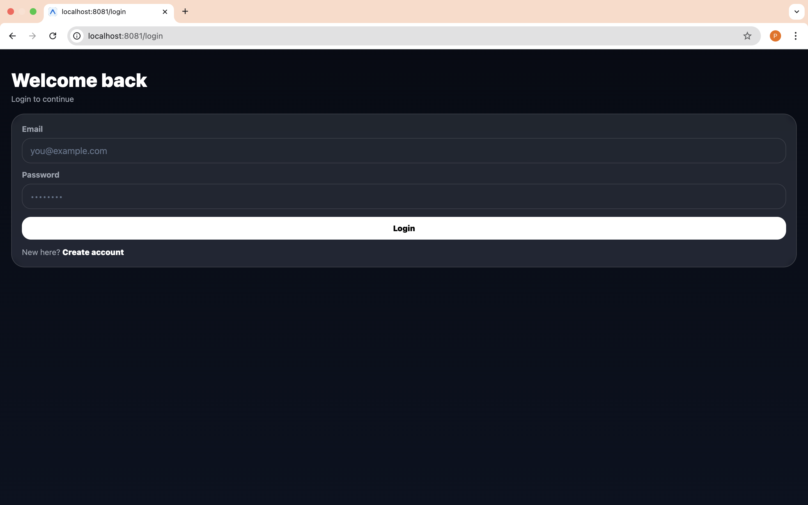
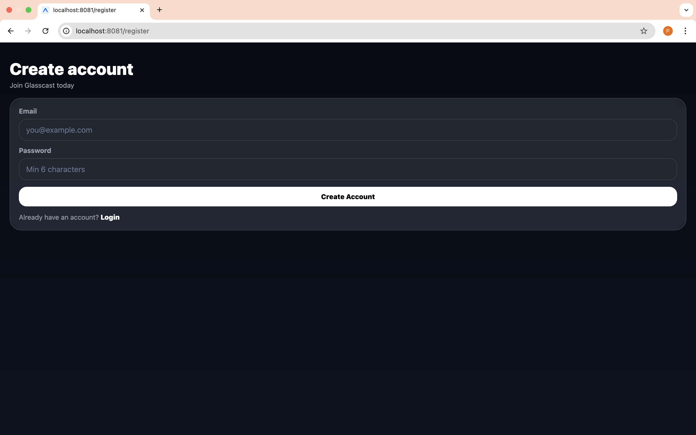
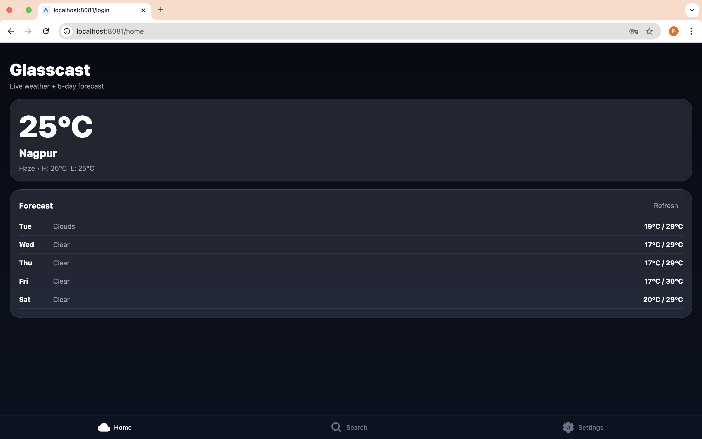
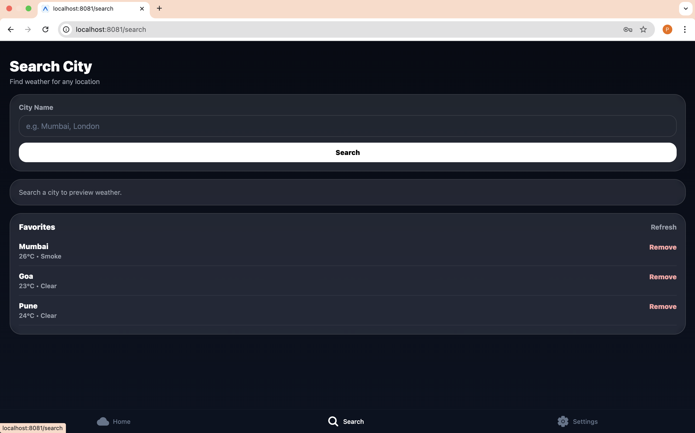
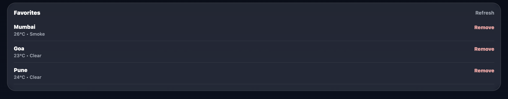
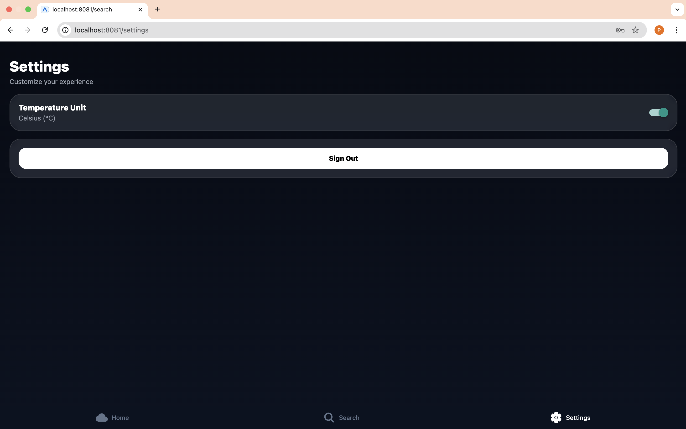

# Glasscast 🌤️ (BrewApps Screening Assignment)

Glasscast is a modern weather app built with **React Native (Expo Router)** featuring a clean **glassmorphism UI**, real-time weather, 5-day forecast, city search, favorites, authentication, and unit switching.

---

## 🚀 Features

## 📸 Screenshots

| Login                         | Signup                         |
| ----------------------------- | ------------------------------ |
|  |  |

| Home                         | Search                         |
| ---------------------------- | ------------------------------ |
|  |  |

| Favorites                         | Settings                         |
| --------------------------------- | -------------------------------- |
|  |  |

### ✅ Weather

- Live current weather (temperature, condition, high/low)
- 5-day forecast
- Refresh option

### 🔍 Search

- Search any city worldwide
- Preview current weather instantly

### ⭐ Favorites (Supabase)

- Add any city to favorites
- View favorites list
- Favorites show:
  - city name
  - current temperature
  - weather condition
- Remove favorites

### 🔐 Authentication (Supabase)

- Sign up + login
- Protected screens (tabs only accessible after login)
- Sign out

### ⚙️ Settings

- Toggle between **°C / °F**
- Unit sync across app screens

---

## 🧠 Tech Stack

- **React Native** + **Expo**
- **Expo Router**
- **Supabase Auth & Database**
- **OpenWeatherMap API**
- **Axios**

---

## 📦 Project Setup

### 1) Install dependencies

```bash
npm install

2) OpenWeather API Key

Create an API key from OpenWeatherMap:
https://openweathermap.org/api

Add it inside:

src/constants/env.ts

export const OPENWEATHER_API_KEY = "YOUR_KEY_HERE";

3) Supabase Setup

Create a new Supabase project:
https://supabase.com

Enable Email Authentication:
Authentication → Providers → Email

Create favorite_cities table + policies using SQL editor:

create table if not exists favorite_cities (
  id uuid primary key default gen_random_uuid(),
  user_id uuid not null references auth.users(id) on delete cascade,
  city_name text not null,
  lat double precision,
  lon double precision,
  created_at timestamp with time zone default now()
);

create unique index if not exists unique_user_city
on favorite_cities(user_id, city_name);

alter table favorite_cities enable row level security;

create policy "Users can view their favorites"
on favorite_cities
for select
using (auth.uid() = user_id);

create policy "Users can insert their favorites"
on favorite_cities
for insert
with check (auth.uid() = user_id);

create policy "Users can delete their favorites"
on favorite_cities
for delete
using (auth.uid() = user_id);


Update Supabase credentials in:

src/lib/supabase.ts

const SUPABASE_URL = "YOUR_PROJECT_URL";
const SUPABASE_ANON_KEY = "YOUR_PUBLISHABLE_KEY";

▶️ Run the App
Web
npx expo start --web

Mobile
npx expo start

Scan QR with Expo Go.


## 🎥 Loom Videos
- App Walkthrough: <https://www.loom.com/share/59a812e4af1f479b8c487bac04490e0e>
- AI Workflow Walkthrough: <https://www.loom.com/share/9722a10d1e564ecebda57399e9b9fc7b>

## 🎨 Design (Figma / Stitch)
- Design URL: <https://www.figma.com/design/yc2Wls2O9Xd8cACBIAcIVR/Glasscast-UI-Screens-%E2%80%93-Login--Home--Search--Favorites--Settings?node-id=0-1&t=vGkKobqZ6ginaAYr-1>


✅ Notes

UI is inspired by modern glassmorphism patterns.

Favorites are stored securely using Supabase + Row Level Security.

Unit toggle (°C/°F) updates API calls and UI globally.

👤 Author

Pratik Dhote


Done ✅
```
